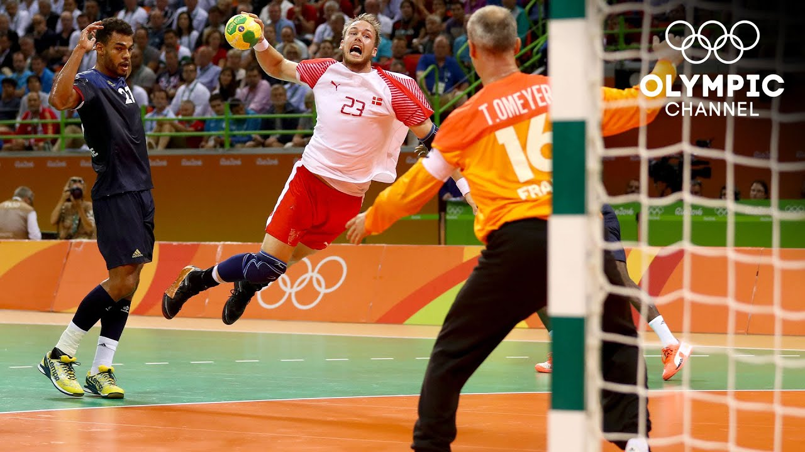
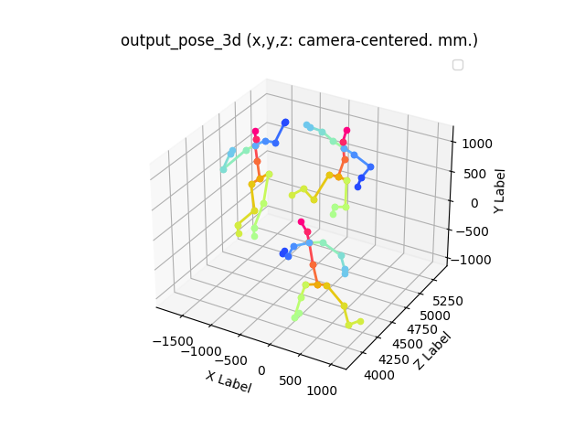
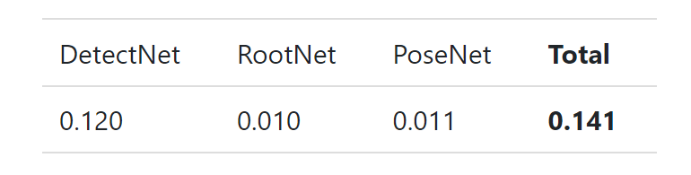
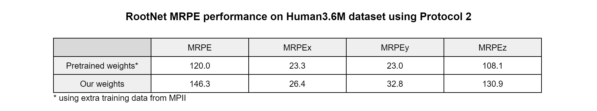
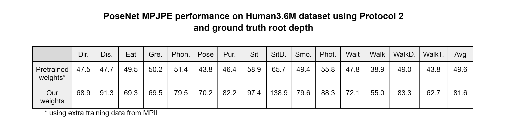
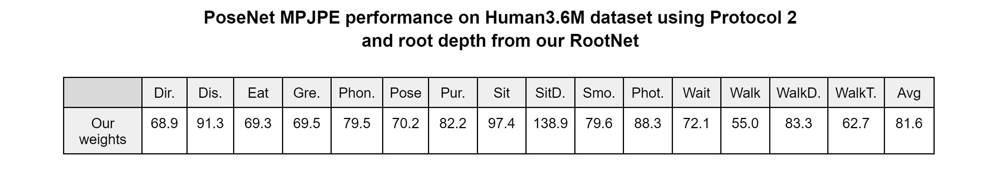

# DLAV

 

## Overview

This repository was made for the Deep Learning for Autonomous Vehicles course at EPFL. The task of this project is 3D Human Pose Estimation from a single RGB camera as implemented in the paper "Camera Distance-aware Top-down Approach for 3D Multi-person Pose Estimation from a Single RGB Image" (https://arxiv.org/pdf/1907.11346v2.pdf). 

The model uses three networks for this task. The first one is called DetecNet and is used to compute the bounding boxes around each person in the frame. They are then fed to the second network called RootNet that estimates the absolute position of the root of each person. Finally, the third network called PoseNet uses the bounding boxes to estimate the relative 3D position of all the joints for every subject and uses the absolute root position from RootNet to output the absolute 3D pose estimation.

## Usage

Run the `inference.sh video` script, where video is the name of the video you want to use in .mp4 format. You can change the trained weights you want to use in the script by changing the `--test_epoch xx` number for weights in this format: `snapshot_xx.pth.tar`. The current version is using pretrained weights from the MuCo dataset but you can alternatively change `inference_posenet_MuCo` to `inference_posenet_Human36M` in the inference script to use weights trained with this code.

The script will split the video into frames and place the images in a folder called `frames`. For each frame in `frames`, it will compute the bounding boxes and place them in `bboxes`. It will then run the image through RootNet and compute the absolute root position using the bbox information and place the result in `3DMPPE_ROOTNET_RELEASE/output/result`. Finally, it will run the image through PoseNet and compute the complete 3D skeleton. The 2D visualization is placed in `3DMPPE_POSENET_RELEASE/output/vis`. You can enable 3D visualization by uncommenting the last 2 lines in the `inference_posenet_xx.py` file.

## Experiments

As shown below, we noticed that the inference time was dominated by the DetectNet module. Autonomous vehicles require real-time performance so we decided to try replacing the original architecture (Mask R-CNN) by a DETR (DEtection TRansformer) architecure. We decided to focus primarily on the 3D detection part so we used pretrained weights for DetectNet.

## Dataset

We have used the dataset Human 3.6M for this task as it provides a very large amount of data and 3D annotations. It is too large to be handled on a personal computer so we used scitas to access the data. However, we used an external source for the annotations as explained in the `training` section. For practical reasons, we changed to model to use exculsively information from the Human3.6M dataset instead of a combination of that and MPII.

The images from Human3.6M are ran through a preprocessing step to normalize them and give the right shape for input into the nets. This step is important because it allows the model to converge faster, helps it to avoid the vanishing gradient problem and makes it more robust to variations in the input data. We also ran data augmentation steps for training such as scaling, rotation, flip, color changes and occlusion to make the model more robust to noise and uncertainties.

## Training

For training or testing, you must download annotations.zip from Google Drive (you can delete everything after the .zip extension for extraction): https://drive.google.com/drive/folders/1r0B9I3XxIIW_jsXjYinDpL6NFcxTZart

The .json files must be put in a folder named "annotations" in the same directory as Human36M.py. These files contain the annotations and the ground truth bounding boxes for the Human3.6M dataset. 

Before training or testing RootNet or PoseNet, you must adapt the paths for `self.annot_path`, `self.human_bbox_dir` and `self.human_bbox_root_dir` in `data/Human36M/Human36M.py` with your own scitas directory. Please note that the image paths are adapted to the `h3.6` dataset on scitas only. If you want to use another location or classification of the dataset, you must change the corresponding paths in `data/Human36M/Human36M.py`.

To use your own bounding boxes, you must place them in the `bbox` folder in `/data/Human36M/` according to the CoCo annotations format.

For more details on how to train each model, please refer to the README.md file in the corresponding folder.

## Results

We trained RootNet for 9 epochs instead of 20 for the original paper for practical reasons, which could explain a gap in performance. We used the following training parameters: a learning rate starting at 1e-3 decaying by a factor of 10 between each epoch after the 17th one, with a batch size of 32, using the Adam optimizer. The decaying learning rate theoretically allows faster convergence and more stability than a fixed learning rate. 

We can see that the performance on RootNet is a bit worse than the original paper but still comparable.

For PoseNet, we used 12 epochs instead of 25, again for practical reasons, which shows a big performance gap between our trained model and the pretrained one. We again used a decaying learning rate, starting at 1e-3 and decaying by a factor of 10 between each epoch after the 17th one, then by a factor of 100 after the 21st one for better stability. We used the Adam optimizer and a batch size of 32 as previously.

The table below shows the performance for the total project, using our own bounding boxes and root depth from the trained RootNet. The performance is close to the results from the ground truth root depth, indicating that a better training for PoseNet would greatly impact the overall performance.

The implementation of the DETR architecture for DetectNet did not yield satsfying results compared to the Mask R-CNN architecture. However, the transformer architecture can still have advantages compared to other architectures, such as better flexibility (detecting humans in more various contexts, which could also be useful considering for in-the-wild scenarios), and a simpler training than most architectures.

## Conclusion

Overall, our model does not perform as well as the one from the original paper. This could be due to too short trainings for the RootNet and PoseNet, or the use of only one dataset for training. The inference is also relatively slow, not making it very suitable for real-time applications such as autonomous driving. During this project, we learned to tune a deep learning model, understanding all the parameters and their effects, as well as using external gpus such as scitas to handle large datasets. The hardest part was to manipulate the data and get the model to work on a different data structure than intended by the authors. We didn't have enough time to train our models as much as we planned to, but the code is capable of computing the 3D pose estimation from a video which was the initial goal.

## References

Original model data: https://paperswithcode.com/paper/camera-distance-aware-top-down-approach-for/review/?hl=57519

@InProceedings{Moon_2019_ICCV_3DMPPE,
author = {Moon, Gyeongsik and Chang, Juyong and Lee, Kyoung Mu},
title = {Camera Distance-aware Top-down Approach for 3D Multi-person Pose Estimation from a Single RGB Image},
booktitle = {The IEEE Conference on International Conference on Computer Vision (ICCV)},
year = {2019}
}
